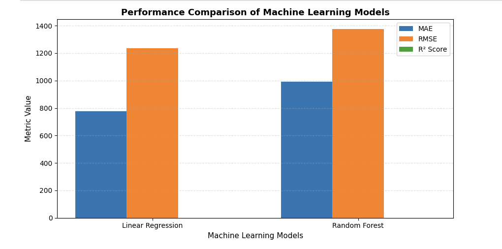
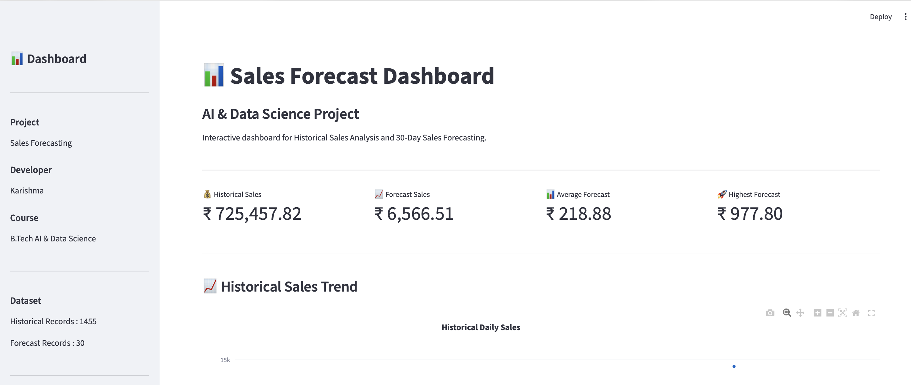
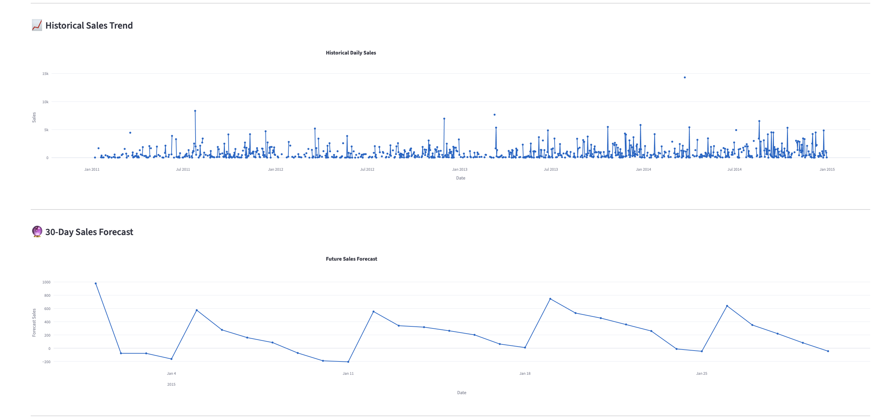
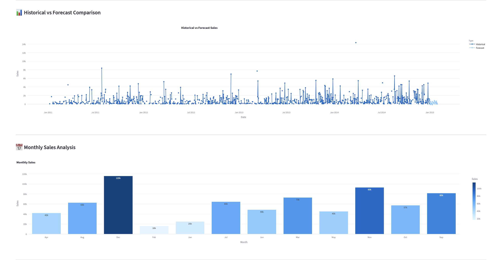
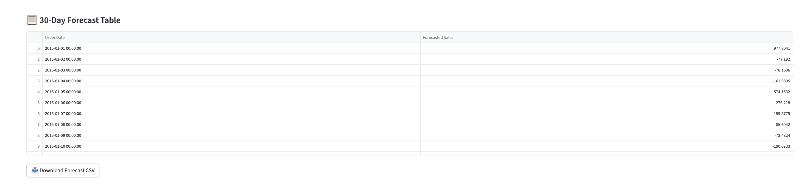

# 📊 Sales Forecasting Using Machine Learning


## 📌 Project Overview

This project focuses on predicting future sales using Machine Learning techniques. Historical sales data is analyzed through data preprocessing, exploratory data analysis (EDA), feature engineering, model training, and evaluation. The trained model is then used to forecast future sales, and the results are presented through an interactive Streamlit dashboard.

---

## 🎯 Objectives

- Analyze historical sales data.
- Perform data preprocessing and cleaning.
- Conduct Exploratory Data Analysis (EDA).
- Create time-series and lag-based features.
- Build and compare Machine Learning models.
- Forecast future sales.
- Visualize results using an interactive dashboard.

---

## 📂 Project Structure

```
Sales_Forecasting_Project/
│
├── dashboard/
│   └── app.py
│
├── data/
│   ├── raw/
│   └── processed/
│
├── images/
│
├── models/
│
├── notebooks/
│   ├── 01_Data_Understanding.ipynb
│   ├── 02_Data_Cleaning.ipynb
│   ├── 03_Exploratory_Data_Analysis.ipynb
│   ├── 04_Time_Series_Preparation.ipynb
│   ├── 05_Feature_Engineering.ipynb
│   ├── 06_Model_Building.ipynb
│   ├── 07_Model_Evaluation.ipynb
│   └── 08_Sales_Forecasting.ipynb
│
├── reports/
│
├── README.md
├── requirements.txt
└── .gitignore
```

---

## 📊 Dataset

The project uses historical sales data containing sales transactions over time. After preprocessing, additional time-series features were generated to improve forecasting performance.

### Features Used

- Order Date
- Sales
- Year
- Quarter
- Month
- Week
- Day
- DayOfWeek
- IsWeekend
- Lag_1
- Lag_7
- Lag_30
- Rolling_Mean_7
- Rolling_Mean_30
- Rolling_STD_7
- Expanding_Mean
- Month_Sin
- Month_Cos
- Day_Sin
- Day_Cos

---

## ⚙️ Technologies Used

- Python
- Pandas
- NumPy
- Scikit-learn
- Plotly
- Streamlit
- Matplotlib
- Jupyter Notebook
- VS Code

---

## 🔄 Project Workflow

```
Historical Sales Data
          ↓
Data Preprocessing
          ↓
Exploratory Data Analysis
          ↓
Feature Engineering
          ↓
Model Building
          ↓
Model Evaluation
          ↓
Sales Forecasting
          ↓
Dashboard Development
```

---

## 🤖 Machine Learning Models

The following models were implemented and evaluated:

- Linear Regression
- Random Forest Regressor

Model performance was evaluated using:

- Mean Absolute Error (MAE)
- Root Mean Squared Error (RMSE)
- R² Score

---
## Model Performance Comparison



---

## 📈 Dashboard Features

The Streamlit dashboard includes:

- Historical Sales Analysis
- Sales Forecast Visualization
- Monthly Sales Analysis
- Historical vs Forecast Comparison
- Business Insights
- Forecast Data Table
- Download Forecast CSV

---

## 📷 Dashboard Preview

## Dashboard Home



## Historical Sales Trend



## Analysis Charts



## Forecast Table



Example:

```
images/
├── dashboard_home.png
├── sales_trends.png
├── analysis_charts.png
└── forecast_table.png
```

---

## 🚀 How to Run the Project

### 1. Clone the repository

```bash
git clone <repository-link>
```

### 2. Install dependencies

```bash
python -m pip install -r requirements.txt
```

### 3. Launch the dashboard

```bash
python -m streamlit run dashboard/app.py
```

The dashboard will open in your browser at:

```
http://localhost:8501
```

---

## 📋 Project Outcomes

- Built a complete machine learning pipeline for sales forecasting.
- Performed feature engineering using lag and rolling statistics.
- Compared forecasting models using evaluation metrics.
- Developed an interactive dashboard for business visualization.
- Generated future sales predictions using historical sales data.

---

## 🔮 Future Scope

- Deep Learning (LSTM/GRU) based forecasting
- Real-time sales prediction
- Cloud deployment
- Interactive filtering
- API integration
- Automated report generation

---

## 👨‍💻 Developer

**Karishma**

B.Tech – Artificial Intelligence and Data Science

Guru Jambheshwar University of Science and Technology

---

## 📜 License

This project is developed for educational and academic purposes.
